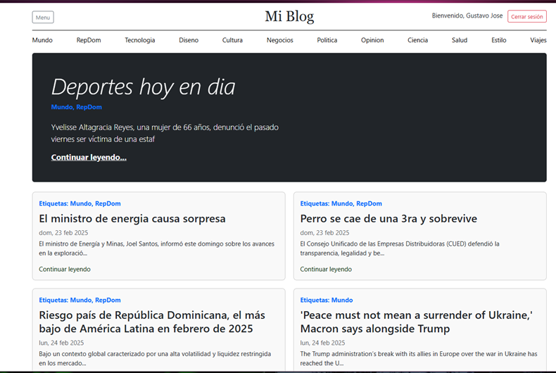
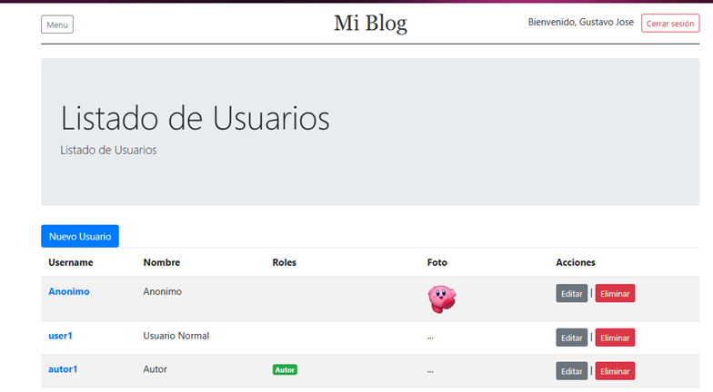

# 📝 Miniblog

A full-stack blog web application built with **Java**, **Javalin**, **Thymeleaf**, **Hibernate/JPA**, and **PostgreSQL**. The project demonstrates a traditional MVC architecture with session-based authentication, role management, and complete CRUD operations for multiple entities.

---


### General Overview — Main Page




---

### User CRUD — Admin Panel




---

## 🛠️ Tech Stack

| Layer        | Technology                          |
|--------------|--------------------------------------|
| Language     | Java 17+                             |
| Web Framework| Javalin 6.4                         |
| Template Engine | Thymeleaf 3.1                    |
| ORM          | Hibernate 6 / Jakarta Persistence   |
| Database     | PostgreSQL / H2 (embedded fallback) |
| Build Tool   | Gradle (Shadow JAR plugin)          |
| Auth         | Session-based + Cookie + Jasypt encryption |
| Real-time    | WebSockets (Javalin WS)             |
| API Docs     | OpenAPI + Swagger UI + ReDoc        |

---

## 🚀 Features

### 🔐 Authentication & Authorization

- **Login / Logout** — Form-based authentication with session management.
- **Remember Me** — Encrypted cookie (`Jasypt`) keeps the user logged in across sessions for up to 7 days.
- **User Registration** — New users can sign up with a name, username, password, and optional profile photo.
- **Role-based Access Control** — Three roles are enforced at the route level:
  - `Anonymous` — Can read articles and leave comments.
  - `Autor` — Can create and manage articles.
  - `Administrador` — Full access including User CRUD and photo management.
- **Auth Logging** — Every successful login is registered in an external CockroachDB table via `AuthService`.

---

### 📰 Blog

- **Article Feed** (`/blog/inicio`) — Paginated list of published articles (5 per page) with infinite-scroll via AJAX (`/art`).
- **Article Detail** (`/blog/{param}/{name}`) — Full article view with body content, author, date, and tags.
- **Tag Filtering** — Articles can be filtered by `Etiqueta` (tag) through query parameters.
- **Comment System** — Authenticated users can post comments on articles. Comments are linked to both the article and the author.

-
## 📁 Project Structure

```
Miniblog/
├── build.gradle
├── src/
│   └── main/
│       ├── java/app/
│       │   ├── Main.java                  # App entry point, route definitions
│       │   ├── controllers/
│       │   │   ├── blogController.java    # Blog feed, comments
│       │   │   ├── CrudUsuarioController.java
│       │   │   ├── CrudAritculoController.java
│       │   │   ├── FotoController.java
│       │   │   └── chatController.java
│       │   ├── entidades/                 # JPA Entities
│       │   ├── servicios/                 # Business logic & DB access
│       │   └── util/
│       └── resources/
│           ├── templates/
│           │   ├── BlogPagInicio.html     # Main blog page
│           │   ├── blog.html              # Article detail page
│           │   ├── formulario.html        # Login form
│           │   ├── registro.html          # Registration form
│           │   ├── menu.html              # Navigation menu
│           │   ├── crud-tradicional/      # User & Article CRUD templates
│           │   ├── dashboard/             # Admin dashboards
│           │   └── foto/                  # Photo templates
│           └── publico/                   # Static assets (CSS, JS, images)
└── database/
```

---

## ⚙️ Running the Project

### Prerequisites

- Java 17+
- PostgreSQL running locally (or configure H2 for embedded mode)
- Gradle

### Run

```bash
./gradlew run
```

The server starts on **port 7071** by default.

- Blog: [http://localhost:7071/blog](http://localhost:7071/blog)
- User CRUD: [http://localhost:7071/crud-simple](http://localhost:7071/crud-simple)
- Article CRUD: [http://localhost:7071/crud-articulo](http://localhost:7071/crud-articulo)

### Build fat JAR

```bash
./gradlew shadowJar
```

---


## 📡 API Documentation

The project integrates OpenAPI 3 documentation via the `javalin-openapi-plugin`:

- **Swagger UI** → `/swagger`
- **ReDoc** → `/redoc`
- **Raw JSON Schema** → `/openapi`
